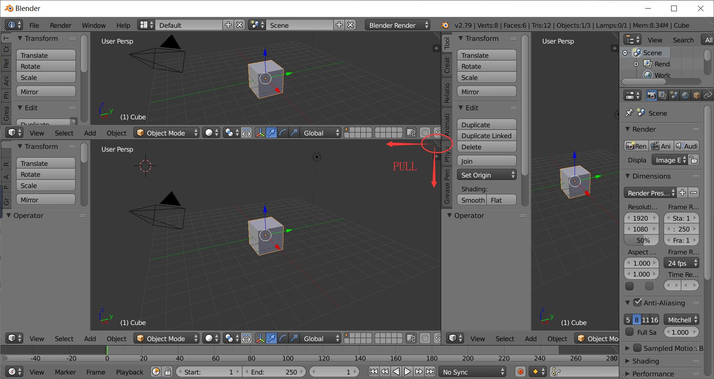
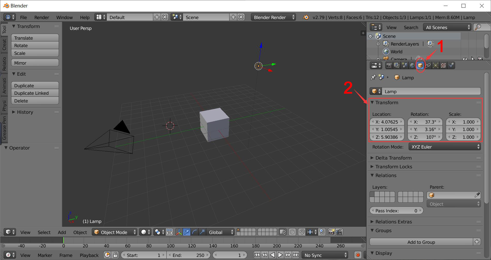
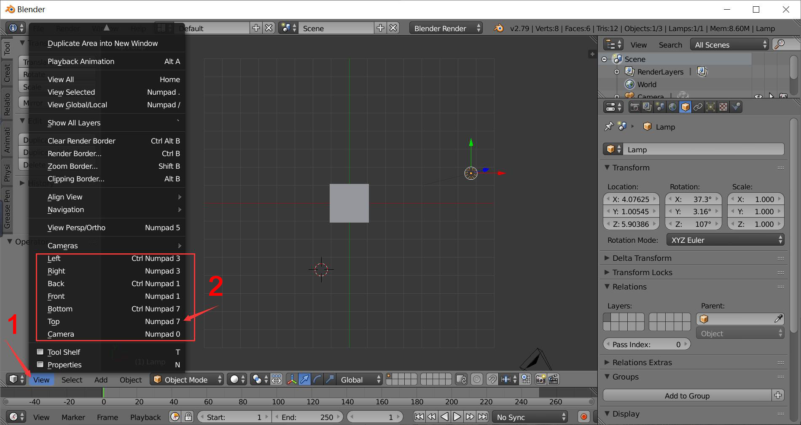
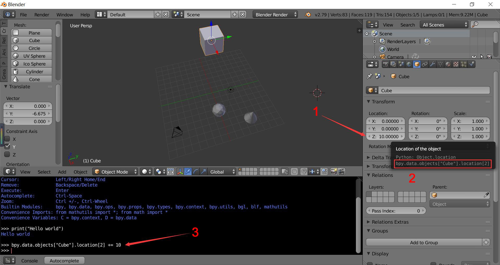

# Blender for cv
This repo provides tutorials and a library to help CV researchers to generate data using blender.

## Introduction

Blender is good for single image rendering; it provides complete python interface and good support for shapenet models.

Game engine based software (Unreal, Unity) provides a virtual world for simulation, which is better for agents to interact with the environment; a lot of VR assets to buy in the market.

## Blender tutorial

#### panel

The whole interface is divided into several panels, each panel has type and the type can be changed (3D view, Timeline, etc).

##### split new panel

To create more panels, drag the triangle on the right top of the main panel, and pull towards left or down, a new panel will appear.

##### merge panels

To merge two panels, drag the triangle and pull towards top or right to merge the corresponding panel.

#### Navigate

left click - pivot point

right click - select

wheel - zoom in / out

#### Import object

File -> import -> .obj

Press F12 to render the image (see the objects from camera point)

Press F11 to go back

#### Change the camera location in the interface

Directly move the camera and point light in the 3D viewpoint scene. Use the options below to change the location, rotation and scale.

Select the object panel and change the number of these objects.

Use the **view** menu to toggle to other views. (The example below shows the top view)

#### Add more object to the scene

From the left panel **Create** to find objects to put into the scene.

All the objects in the scene are shown in the **Outliner** panel.

#### Use python to control the scene

Switch the bottom panel to **python console**

Try to print `hello world`

But how to control objects in the scene by python?

Use the **bpy** module provided by Blender to access the scene.

Hover over text field to get the object's python value and change it in python console using python grammar.

#### Build the automation pipeline

Switch the panel type to **text editor**,  new or open a file and write python script in it.

Finish your script then click **Run script** to see the difference.

*Be aware that while writing in the file, you need to **import bpy** first, or there may be error.* 

## Best way to run the script

In the last section, we introduce the way of running script within Blender, but usually we would like to run it in the command line. 

This section tells how to write scripts to achieve generating images automatically.

To start Blender in the command line, we can use `blender --script xxx.py` to run `xxx.py` in Blender

#### Two types of python scripts

- Outside to call Blender
- Inside Blender to control Blender

## Library tutorial

This repo provides a simple package `blcv` that can put models into scene and get images from different viewpoints.

#### Install

You can use `pip install blcv ` to install the package.

Note that we should use `blcv` in Blender's bundled Python, so you need to install the package in Blender's Python environment.

Use the following commands:

`$ cd /blender-path/2.xx/python/bin/`

`/blender-path/2.xx/python/bin$ python.exe get-pip.py`

`/blender-path/2.xx/python/bin$ python.exe -m pip install blcv`

If you encounter more problems, you can refer to this [answer]( https://blender.stackovernet.com/cn/q/14721 ).

#### Functions

blcv

- call_blender(render_code, blender_executable_path, blank_blend_file_path, io_redirect='', background=True): activate Blender and call the script
  - render_code: directory to Blender script
  - blender_executable_path: directory to Blender.exe
  - blank_blend_file_path: Blender file
  - io_redirect: redirect the output into a file, use '' to show the output in command lines
  - background: whether run the Blender in background, default as 'True'

blcv.tools

- BcObject: operate an existed object in the scene
  - init(self, id): input the name of the object
  - destroy(self): delete the object
  - set_loc(self, x, y, z): set the object's location
  - get_loc(self, x, y, z): get the object's location
  - set_rot(self, x, y, z, w=None, mode='XYZ'): set the object's rotation; the mode includes 'AXIS_ANGLE', 'QUATERNION' and 'XYZ'
  - get_rot(self, mode='XYZ', w=None): set the object's rotation; the mode includes 'AXIS_ANGLE', 'QUATERNION' and 'XYZ'
  - set_scale(self, x, y, z): set the object's scale
  - get_scale(self, ): get the object's scale
- BcCamera(BcObject): operate an camera in the scene
  - init(self, id): input the name of the camera
  - set_camera_to_center(self, dist, azimuth_deg, elevation_deg, theta_deg): given the camera's rotation, set the camera in the position towards the center point [0, 0, 0]
- BcScene:
  - init(self)
  - set_render_mode(self, mode): set the background mode
  - get_img(self, filepath): save image crop in filaepath
- import_obj(shape_file): import a new model into the scene and return its name

#### Demo

You can modify the configurations and run `start_blender.py` to call `blender_script` in Blender.

The demo generates airplane images from circle viewpoints using the models in `examples` folder, the results will be saved in `images` folder.

#### Contact

If you have any questions or encounter any problems, feel free to contact me by sarahwei0210@gmail.com.

